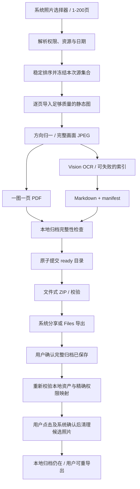

# Architecture

状态：目标架构，待 Codex 分阶段实现。不要把此图当实现证据。

## Pipeline



## 技术栈

| 层 | 选择 | 边界 |
|---|---|---|
| UI | SwiftUI + 少量 UIViewControllerRepresentable | iPhone；导航与 UIKit bridge 主线程 |
| 选照片 | PHPickerViewController / PhotosUI | 显式使用 PHPhotoLibrary 初始化配置以获取可用 identifier |
| 权限/元数据/清理 | PhotoKit | .readWrite 可拒绝；不要求全库授权才能归档 |
| 图像 | ImageIO / CoreGraphics | 文件输入、方向、缩放、sRGB、JPEG；不用 Core Image 裁切 |
| OCR | VNRecognizeTextRequest | accurate、支持语言查询；单图执行；不推断图表含义 |
| PDF | UIGraphicsPDFRenderer.writePDF(to:withActions:) | 逐页绘制、文件写出；禁用全 PDF Data 聚合 |
| 预览/检查 | PDFKit | 文件式加载；检查 pageCount；压力测试其缓存 |
| ZIP | ZIPFoundation 固定版本 | 文件式写入与逐块检查；无全 ZIP Data |
| 完整性 | CryptoKit SHA256 + 字节数 | 检测损坏，不证明 OCR 正确或远程持久化 |
| 本地状态 | Codable JSON + 原子文件写入 | 无 SwiftData/CoreData/后端；单处理作业 |
| 工程 | XcodeGen + Swift Package Manager | project.yml 可审查；锁定依赖与工具版本 |

## 代码模块

```text
App/                         SwiftUI screens, navigation, privacy/help
Platform/                    PhotoLibraryClient, PickerBridge, ExportClient
Pipeline/                    Importer, ImageNormalizer, OCRClient, PDFWriter, ArchiveWriter
Packages/LectureAssetCore/    Codable models, ordering, manifest/MD, eligibility state machine
Tests/                       unit + integration + XCUITest
Config/                      plist, String Catalog, PrivacyInfo, build settings
```

Core 不依赖 UIKit/PhotoKit，便于在可用环境测试。真实系统行为由 Platform 适配器与真机验收承担，mock PASS 不等于 PhotoKit PASS。

一个 pipeline actor 串行管理作业；UI 状态在 MainActor。CPU/IO 密集操作不得因 async 函数写在 ViewModel 就留在主线程。每页 autoreleasepool 或等效生命周期；最多一个高分辨率解码对象；缩略图独立限额缓存。不为每页无上限创建 Task。

## 导入与权限

- 用户进入整理流程时说明读写图库的用途；授权拒绝后仍允许选择器 provider 导入。
- PHPickerConfiguration(photoLibrary: .shared())；image filter；selectionLimit=200；记录选择序号。
- 有可访问 PHAsset 时读取 captureDate/modificationDate/mediaSubtypes，并获取当前静态呈现的足够质量数据；不拿相册缩略图充当原片。
- provider fallback 使用 loadFileRepresentation 或等效文件 API，必须在临时 URL 生命周期内复制。不得把 temporary URL 直接存成可恢复资产。
- iCloud-only 明示系统下载需要网络与空间；PhotoKit 路径默认不自动下载，用户同意后重试。provider 路径也必须事先告知系统可能下载。
- 可访问 asset、仅 provider 可导入、无日期、Live Photo、不可用分别建模。所有 PhotoKit localIdentifier 只保存在本机 ledger。

## 文件生命周期

```text
Application Support/LectureAsset/
  jobs/<UUID>/               私有 job.json、选择映射、checkpoint、局部输出
  archives/<UUID>/           用户可恢复的完整 ready 归档
  ledgers/<UUID>.json         权限映射、导出尝试、清理结果；绝不导出
Caches/LectureAsset/
  exports/<UUID>/<hash>.zip   可重建分享副本，活动结束前不能清理
  thumbnails/                可清理
```

不能把唯一的 ready 归档放 Caches/tmp。job 与 archive 同卷以便最终目录 rename。先逐页验证再 checkpoint；最终生成 PDF/MD/manifest 全部验证后才提交 ready。中断的 PDF/ZIP 重新生成，不续写一个可能不完整的最终文件。

本地 ready 归档按用户文档对待，系统备份遵循明确政策与用户设置；staging、可重建缓存排除备份。卸载 App 会失去其本地数据，应在本地归档清理/帮助中告知。

## 前后台

前台处理为主。进入后台时最多用系统允许的短时间完成当前安全 checkpoint，然后暂停；到期取消工作并保存状态。返回/重启后验证 checkpoint，继续或重试。不得承诺任意锁屏时长都能处理完，也不新增 BGProcessing 调度或后台摄像。

## 顺序

按 (captureDate 是否缺失、captureDate、selectionIndex) 稳定排列。未知日期不能伪造。异步载入完成顺序不参与排序。文件名统一从 0001 起四位补零，manifest/page/PDF/Markdown 使用同一个 orderedPages 数组。

## 工具链

目标：Swift 6、deployment iOS 18.0。计划锁定 ZIPFoundation 0.9.20；XcodeGen 初始参考 2.46.0，S00 在实际环境验证并记录精确可用版本及提交。不得将未经实际验证的工具锁文件标记为已通过。Xcode 与 SDK 必须满足 Apple 当时提交要求，并在 S05 重查。
