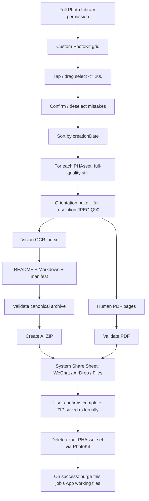

# Architecture — v0.1 target

这是待实现架构，不是已通过的工程证据。

## Pipeline



## Framework choices

| Concern | Implementation |
|---|---|
| App UI | SwiftUI |
| High-control photo grid | UIKit `UICollectionView` bridged into SwiftUI |
| Library access / metadata / delete | PhotoKit |
| Thumbnail caching | `PHCachingImageManager` |
| Full still retrieval | `PHImageManager.requestImageDataAndOrientation` or equivalent installed-SDK API verified in S01 |
| Image decode/encode | ImageIO + CoreGraphics |
| OCR | Vision |
| PDF | UIGraphicsPDFRenderer + PDFKit validation |
| ZIP | ZIPFoundation, pinned |
| Hashes | CryptoKit SHA256 |
| Share | UIActivityViewController |
| State | Codable file-backed job state; no DB needed |
| Localization | String Catalog zh-Hans + en |
| Build | XcodeGen + SPM |

## Permission model

No picker/provider fallback.

On launch/use:

```text
notDetermined -> request readWrite
authorized    -> continue
limited       -> blocking screen + Open Settings
denied        -> blocking screen + Open Settings
restricted    -> blocking explanation
```

`NSPhotoLibraryUsageDescription` must explain both browsing/selecting and user-confirmed cleanup.

## Selection grid

PhotoKit fetch:

- `.image` mediaType only.
- newest-first for browsing.
- custom cells with thumbnails, Live Photo badge, selected order/count.
- a pan gesture tracks entered index paths. Gesture mode is decided at touch start: if start cell unselected, select traversed cells; if selected, deselect traversed cells.
- stop adding at 200 and provide haptic/banner feedback.
- support edge autoscroll while dragging.
- confirmation converts source set to deterministic chronological order; selected order is only tie-breaker.

This custom grid is required because the product explicitly wants Photos-like swipe selection and full library access.

## Full-resolution still pipeline

For each ordered PHAsset:

1. Request full-quality current still with network access disabled.
2. If only iCloud copy is available, fail visibly; never substitute thumbnail.
3. Decode with ImageIO, apply orientation to pixels.
4. Preserve retrieved still's full pixel dimensions; no resize/crop.
5. Convert to sRGB JPEG Q90 using Apple encoder.
6. Write file, measure bytes/dimensions/SHA256, release full-size buffers.
7. Run OCR on the final JPEG.
8. Checkpoint before moving to next asset.

For a Live Photo, this code path intentionally never requests/copies paired video. Private ledger records only the PHAsset identifier needed to delete the entire asset later.

## File lifecycle

```text
Application Support/LectureAsset/jobs/<UUID>/
  job.json
  ledger.json                 # private; PHAsset IDs; never export
  ready/
    README.md
    lecture.md
    manifest.json
    slides/*.jpg
  companion/
    lecture.pdf

Caches/LectureAsset/exports/<UUID>/
  <hash>.zip
```

The ready directory must survive app restart until external-save confirmation and source cleanup.

After PhotoKit reports successful deletion of the exact selected asset set:

- delete job ready/companion;
- delete ZIP/cache;
- delete private ledger/job;
- show completed state in memory only / lightweight no-content marker if needed.

No “recent archives” knowledge base.

## AI ZIP and PDF

AI ZIP contains only README/MD/manifest/slides. PDF is a separate companion file so the ZIP does not duplicate every raster page again.

PDF starts with a bounded browse-quality raster policy (about 3000px long edge, JPEG ~0.90), but S02 must validate on real PPT small text and adjust upward if necessary.

## Export/delete state

Keep separate states:

- generation: working / failed / ready
- zip: absent / valid
- share: never / presenting / reportedCompleted / cancelled / failed
- userExternalSaveConfirmed: false / true
- cleanup: never / requesting / succeeded / failed / unknown

Share completion alone never triggers PhotoKit deletion. Cleanup is invoked only from a fresh user action after explicit confirmation.

## Background / failures

Foreground-first. On background transition, finish only a bounded safe checkpoint then pause. Relaunch reads job state and revalidates files.

If one image cannot be acquired/converted, the job is not “complete”. UI offers retry or explicit removal before regenerating the frozen page set; removed assets are also removed from cleanup ledger.

## No-network rule

Lecture Asset itself has no HTTP client, backend, GitHub/WeChat SDK or analytics SDK. Photo retrieval sets network access false. Share extensions are external system/app behavior and may network independently.
